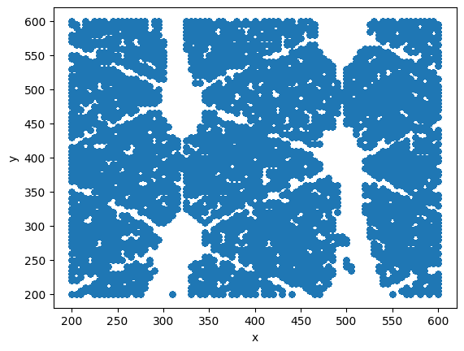

# Predicting Spatial Coordinates of Particles using Machine Learning

This project focuses on predicting the spatial coordinates of particle interactions in particle physics by employing various machine learning techniques. The aim is to enhance the accuracy of detecting particle trajectories using data collected from Resistive Silicon Detectors (RSDs).

## Table of Contents

- [Introduction](#introduction)
- [Problem Overview](#problem-overview)
- [Dataset](#dataset)
- [Proposed Approach](#proposed-approach)
  - [Preprocessing](#preprocessing)
  - [Model Selection](#model-selection)
- [Results](#results)
- [Additional Resources](#additional-resources)

## Introduction

The report presents a comprehensive approach to predicting the (x, y) coordinates of particles. By utilizing refined datasets, feature selection, and advanced models like Random Forest and Multi-Layer Perceptron (MLP), we achieve notable improvements in predictive accuracy.

## Problem Overview

Detecting the trajectory of particles poses significant challenges in particle physics. This project leverages RSDs, which generate signals containing valuable information about particle interactions. The primary goal is to reconstruct the hit positions of particles using signal properties like amplitude, area, and width.

## Dataset

The study involves two datasets:

- **Development Dataset**: 385,500 events
- **Evaluation Dataset**: 128,500 events

Each event captures unique interactions of particles with sensor pads, recording various signal properties that provide trajectories with specific (x, y) coordinates.

The datasets are available in the `/AdditionalResources/Datasets/` directory.

Here’s a visualization showcasing the original particle data and the distribution of (x, y) coordinates:

## Proposed Approach

### Preprocessing

The preprocessing phase is crucial for making accurate predictions. Techniques utilized include:

- **Feature Selection**: Utilizing mutual information and random forest regressor feature importance to select relevant features for x and y coordinates separately.
- **Scaling and Normalization**: Standardizing features using Z-score normalization to ensure robust training.

### Model Selection

Two models are employed to predict the x and y coordinates:

- **Random Forest Regressor**: An ensemble method that builds multiple decision trees and averages their predictions.
- **Multi-Layer Perceptron (MLP)**: A neural network architecture that captures complex relationships within the data.

## Results

The performance of the models is measured using the Euclidean distance:

| Model                                      | Euclidean Distance |
|--------------------------------------------|--------------------|
| Random Forest Regressor                    | 4.824              |
| MLP                                        | 4.251              |
| Ensemble MLP                               | 3.980              |
| Ensemble MLP with Rounding Strategy        | 3.851              |

The results indicate significant improvements with each successive approach.

## Additional Resources

The PDF report and LaTeX file detailing the project are available in the `/AdditionalResources/Report/` directory. This documentation provides an in-depth discussion of the methodology, results, and analysis of the project.
